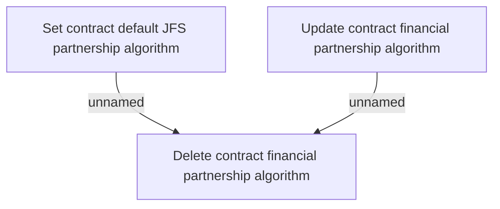

# Business rules

- **Diagram Type**: Custom
- **Package**: HomerSelect/BSL/Analysis Model/Contract Management/Contract financial partnership/Business rules
- **Diagram ID**: 113506
- **Elements**: 3
- **Connectors**: 2

