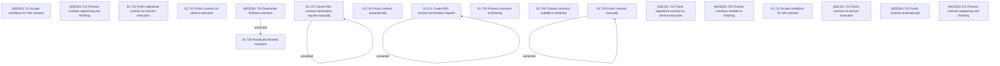

# Access Rights

```mermaid
graph TD
    ADD_01_711_Accept_conditions_for_SAI_contract["{ADD}01.711 Accept conditions for SAI contract"]
    ADD_01_714_Process_contract_registering_and_finishing["{ADD}01.714 Process contract registering and finishing"]
    n_01_713_Finish_registered_contract_on_service_execution["01.713 Finish registered contract on service execution"]
    n_01_712_Finish_contract_on_service_execution["01.712 Finish contract on service execution"]
    n_01_172_Cancel_REL_contract_termination_request_manually["01.172 Cancel REL contract termination request manually"]
    n_01_172_Cancel_REL_contract_termination_request_manually["01.172 Cancel REL contract termination request manually"]
    n_01_171_Create_REL_contract_termination_request["01.171 Create REL contract termination request"]
    n_01_171_Create_REL_contract_termination_request["01.171 Create REL contract termination request"]
    n_01_715_Finish_contract_automatically["01.715 Finish contract automatically"]
    n_01_730_Finish_contract_manually["01.730 Finish contract manually"]
    n_01_730_Finish_contract_manually["01.730 Finish contract manually"]
    n_01_720_Reactivate_finished_contracts["01.720 Reactivate finished contracts"]
    n_01_710_Process_contracts_to_finishing["01.710 Process contracts to finishing"]
    n_01_700_Choose_contracts_suitable_to_finishing["01.700 Choose contracts suitable to finishing"]
    MOD_01_720_Reactivate_finished_contracts["{MOD}01.720 Reactivate finished contracts"]
    DEL_01_713_Finish_registered_contract_on_service_execution["{DEL}01.713 Finish registered contract on service execution"]
    n_01_710_Process_contracts_to_finishing["01.710 Process contracts to finishing"]
    MOD_01_700_Choose_contracts_suitable_to_finishing["{MOD}01.700 Choose contracts suitable to finishing"]
    n_01_711_Accept_conditions_for_SAI_contract["01.711 Accept conditions for SAI contract"]
    DEL_01_712_Finish_contract_on_service_execution["{DEL}01.712 Finish contract on service execution"]
    MOD_01_715_Finish_contract_automatically["{MOD}01.715 Finish contract automatically"]
    MOD_01_714_Process_contract_registering_and_finishing["{MOD}01.714 Process contract registering and finishing"]
    n_01_730_Finish_contract_manually -->|unnamed| n_01_730_Finish_contract_manually
    MOD_01_720_Reactivate_finished_contracts -->|unnamed| n_01_720_Reactivate_finished_contracts
    n_01_171_Create_REL_contract_termination_request -->|unnamed| n_01_171_Create_REL_contract_termination_request
    n_01_172_Cancel_REL_contract_termination_request_manually -->|unnamed| n_01_172_Cancel_REL_contract_termination_request_manually
```
