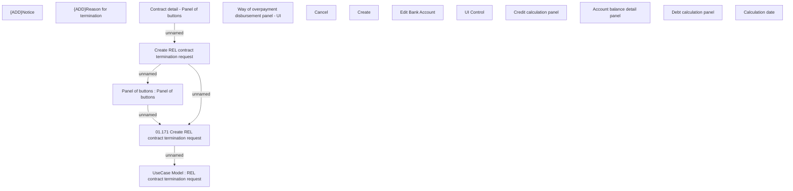

# Create REL contract termination request - UI

```mermaid
graph TD
    ADD_Notice["{ADD}Notice"]
    ADD_Reason_for_termination["{ADD}Reason for termination"]
    Contract_detail_Panel_of_buttons["Contract detail - Panel of buttons"]
    Way_of_overpayment_disbursement_panel_UI["Way of overpayment disbursement panel - UI"]
    Panel_of_buttons_Panel_of_buttons["Panel of buttons : Panel of buttons"]
    UseCase_Model_REL_contract_termination_request["UseCase Model : REL contract termination request"]
    n_01_171_Create_REL_contract_termination_request["01.171 Create REL contract termination request"]
    Cancel["Cancel"]
    Create["Create"]
    Edit_Bank_Account["Edit Bank Account"]
    UI_Control["UI Control"]
    Credit_calculation_panel["Credit calculation panel"]
    Account_balance_detail_panel["Account balance detail panel"]
    Debt_calculation_panel["Debt calculation panel"]
    Calculation_date["Calculation date"]
    Create_REL_contract_termination_request["Create REL contract termination request"]
    Contract_detail_Panel_of_buttons -->|unnamed| Create_REL_contract_termination_request
    Panel_of_buttons_Panel_of_buttons -->|unnamed| n_01_171_Create_REL_contract_termination_request
    Create_REL_contract_termination_request -->|unnamed| n_01_171_Create_REL_contract_termination_request
    Create_REL_contract_termination_request -->|unnamed| Panel_of_buttons_Panel_of_buttons
    n_01_171_Create_REL_contract_termination_request -->|unnamed| UseCase_Model_REL_contract_termination_request
```
