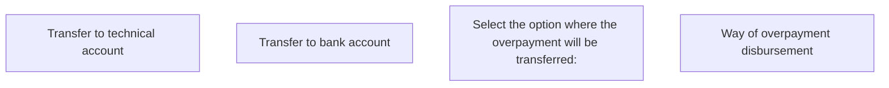

# Way of overpayment disbursement panel - PH

- **Diagram Type**: Custom
- **Package**: HomerSelect/BSL/Analysis Model/Contract Management/Contract finishing/User Interface Model/Way of overpayment disbursement panel/Way of overpayment disbursement panel - PH
- **Diagram ID**: 119287
- **Elements**: 4
- **Connectors**: 0

