# Way of overpayment disbursement panel - UI

- **Diagram Type**: Custom
- **Package**: HomerSelect/BSL/Analysis Model/Contract Management/Contract finishing/User Interface Model/Way of overpayment disbursement panel
- **Diagram ID**: 119285
- **Elements**: 6
- **Connectors**: 0

```mermaid
graph TD
    ADD_Way_of_overpayment_disbursement_panel_ID["{ADD}Way of overpayment disbursement panel - ID"]
    ADD_Way_of_overpayment_disbursement_panel_IN["{ADD}Way of overpayment disbursement panel - IN"]
    Way_of_overpayment_disbursement_panel_PH["Way of overpayment disbursement panel - PH"]
    Way_of_overpayment_disbursement_panel_VN["Way of overpayment disbursement panel - VN"]
    Way_of_overpayment_disbursement_panel_KZ["Way of overpayment disbursement panel - KZ"]
    Way_of_overpayment_disbursement_panel_DC["Way of overpayment disbursement panel - DC"]
```

