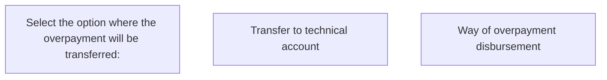

# Way of overpayment disbursement panel - VN

- **Diagram Type**: Custom
- **Package**: HomerSelect/BSL/Analysis Model/Contract Management/Contract finishing/User Interface Model/Way of overpayment disbursement panel/Way of overpayment disbursement panel - VN
- **Diagram ID**: 79630
- **Elements**: 3
- **Connectors**: 0

