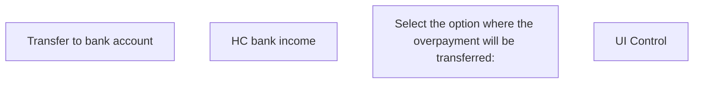

# {ADD}Way of overpayment disbursement panel - ID

```mermaid
graph TD
    Transfer_to_bank_account["Transfer to bank account"]
    HC_bank_income["HC bank income"]
    Select_the_option_where_the_overpayment_will_be_transferred["Select the option where the overpayment will be transferred:"]
    UI_Control["UI Control"]
```
