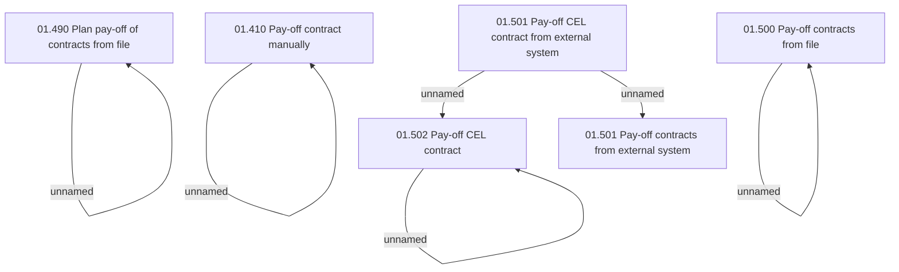

# Access Rights

```mermaid
graph TD
    n_01_501_Pay_off_CEL_contract_from_external_system["01.501 Pay-off CEL contract from external system"]
    n_01_502_Pay_off_CEL_contract["01.502 Pay-off CEL contract"]
    n_01_502_Pay_off_CEL_contract["01.502 Pay-off CEL contract"]
    n_01_501_Pay_off_contracts_from_external_system["01.501 Pay-off contracts from external system"]
    n_01_500_Pay_off_contracts_from_file["01.500 Pay-off contracts from file"]
    n_01_490_Plan_pay_off_of_contracts_from_file["01.490 Plan pay-off of contracts from file"]
    n_01_410_Pay_off_contract_manually["01.410 Pay-off contract manually"]
    n_01_500_Pay_off_contracts_from_file["01.500 Pay-off contracts from file"]
    n_01_490_Plan_pay_off_of_contracts_from_file["01.490 Plan pay-off of contracts from file"]
    n_01_410_Pay_off_contract_manually["01.410 Pay-off contract manually"]
    n_01_490_Plan_pay_off_of_contracts_from_file -->|unnamed| n_01_490_Plan_pay_off_of_contracts_from_file
    n_01_410_Pay_off_contract_manually -->|unnamed| n_01_410_Pay_off_contract_manually
    n_01_500_Pay_off_contracts_from_file -->|unnamed| n_01_500_Pay_off_contracts_from_file
    n_01_501_Pay_off_CEL_contract_from_external_system -->|unnamed| n_01_502_Pay_off_CEL_contract
    n_01_502_Pay_off_CEL_contract -->|unnamed| n_01_502_Pay_off_CEL_contract
    n_01_501_Pay_off_CEL_contract_from_external_system -->|unnamed| n_01_501_Pay_off_contracts_from_external_system
```
