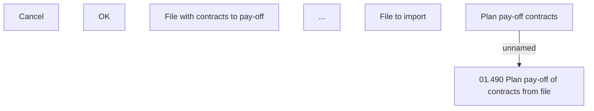

# Pay off contracts from file

- **Diagram Type**: Custom
- **Package**: HomerSelect/BSL/Analysis Model/Contract Management/Contract pay-off/User Interface Model
- **Diagram ID**: 149106
- **Elements**: 7
- **Connectors**: 1

