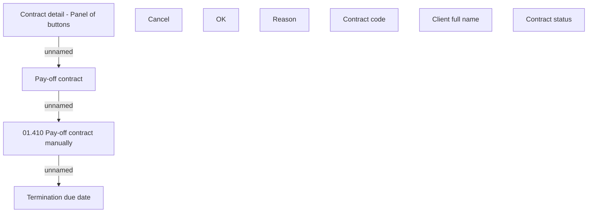

# Pay off contracts

```mermaid
graph TD
    Contract_detail_Panel_of_buttons["Contract detail - Panel of buttons"]
    Termination_due_date["Termination due date"]
    n_01_410_Pay_off_contract_manually["01.410 Pay-off contract manually"]
    Cancel["Cancel"]
    OK["OK"]
    Reason["Reason"]
    Contract_code["Contract code"]
    Client_full_name["Client full name"]
    Contract_status["Contract status"]
    Pay_off_contract["Pay-off contract"]
    Pay_off_contract -->|unnamed| n_01_410_Pay_off_contract_manually
    Contract_detail_Panel_of_buttons -->|unnamed| Pay_off_contract
    n_01_410_Pay_off_contract_manually -->|unnamed| Termination_due_date
```
