# AccessRights

- **Diagram Type**: Custom
- **Package**: HomerSelect/BSL/Analysis Model/Contract Management/Contract registration/AccessRights
- **Diagram ID**: 164062
- **Elements**: 34
- **Connectors**: 16

```mermaid
graph TD
    External_Reference["External Reference"]
    MOD_01_128_Preview_document["{MOD}01.128 Preview document"]
    ADD_01_128_Preview_registration_document_file_download["{ADD}01.128 Preview registration document (file download)"]
    ADD_01_128_Preview_registration_document["{ADD}01.128 Preview registration document"]
    ADD_01_282_Edit_client_or_contract_document["{ADD}01.282 Edit client or contract document"]
    ADD_01_282_Edit_client_or_contract_document["{ADD}01.282 Edit client or contract document"]
    n_01_282_Edit_client_or_contract_document["01.282 Edit client or contract document"]
    ADD_01_280_Record_document_mistake["{ADD}01.280 Record document mistake"]
    MOD_01_280_Record_document_mistake_v2["{MOD}01.280 Record document mistake v2"]
    ADD_01_275_Show_client_photo["{ADD}01.275 Show client photo"]
    ADD_01_275_Show_contract_registration_check_presence_of_all_["{ADD}01.275 Show contract registration - check presence of all unchecked documents"]
    ADD_01_279_Choose_contracts_suitable_to_registration_and_fin["{ADD}01.279 Choose contracts suitable to registration and finishing"]
    MOD_01_279_Choose_contracts_suitable_to_registration_and_fin["{MOD}01.279 Choose contracts suitable to registration and finishing"]
    ADD_01_252_Evaluate_Contract_Service_Parameters["{ADD}01.252 Evaluate Contract Service Parameters"]
    n_01_277_Set_document_registration_check_service["01.277 Set document registration check service"]
    DEL_01_252_Evaluate_Contract_Service_Parameters["{DEL}01.252 Evaluate Contract Service Parameters"]
    n_01_276_Get_documents_for_registration_checking_service["01.276 Get documents for registration checking service"]
    n_01_271_Register_contract_remotely["01.271 Register contract remotely"]
    DEL_01_278_Register_contract_automatically["{DEL}01.278 Register contract automatically"]
    n_01_271_Register_contract_remotely["01.271 Register contract remotely"]
    DEL_01_277_Set_document_registration_check_service["{DEL}01.277 Set document registration check service"]
    n_01_275_Show_contract_registration_check_presence_of_docume["01.275 Show contract registration - check presence of documents"]
    DEL_01_276_Get_documents_for_registration_checking_service["{DEL}01.276 Get documents for registration checking service"]
    n_01_275_Show_registration_tab["01.275 Show registration tab"]
    n_01_290_Activate_contract["01.290 Activate contract"]
    MOD_01_290_Activate_contract["{MOD}01.290 Activate contract"]
    n_01_270_Register_contract_manually["01.270 Register contract manually"]
    n_01_275_Show_contract_registration["01.275 Show contract registration"]
    n_01_270_Register_contract_manually["01.270 Register contract manually"]
    n_01_280_Record_document_mistake["01.280 Record document mistake"]
    n_01_272_Check_presence_of_document_with_barcode_reader["01.272 Check presence of document with barcode reader"]
    MOD_01_274_Activate_disbursed_contracts["{MOD}01.274 Activate disbursed contracts"]
    n_01_274_Activate_disbursed_contracts["01.274 Activate disbursed contracts"]
    n_01_272_Check_presence_of_document_with_barcode_reader["01.272 Check presence of document with barcode reader"]
    n_01_282_Edit_client_or_contract_document -->|unnamed| ADD_01_282_Edit_client_or_contract_document
    n_01_282_Edit_client_or_contract_document -->|unnamed| ADD_01_282_Edit_client_or_contract_document
    MOD_01_280_Record_document_mistake_v2 -->|unnamed| ADD_01_280_Record_document_mistake
    n_01_275_Show_registration_tab -->|unnamed| ADD_01_275_Show_client_photo
    n_01_275_Show_registration_tab -->|unnamed| ADD_01_275_Show_contract_registration_check_presence_of_all_
    n_01_272_Check_presence_of_document_with_barcode_reader -->|unnamed| n_01_272_Check_presence_of_document_with_barcode_reader
    n_01_271_Register_contract_remotely -->|unnamed| n_01_271_Register_contract_remotely
    n_01_275_Show_registration_tab -->|unnamed| n_01_275_Show_contract_registration_check_presence_of_docume
    MOD_01_290_Activate_contract -->|unnamed| n_01_290_Activate_contract
    MOD_01_274_Activate_disbursed_contracts -->|unnamed| MOD_01_290_Activate_contract
    n_01_270_Register_contract_manually -->|unnamed| n_01_270_Register_contract_manually
    n_01_275_Show_registration_tab -->|unnamed| n_01_275_Show_contract_registration
    MOD_01_280_Record_document_mistake_v2 -->|unnamed| n_01_280_Record_document_mistake
    MOD_01_274_Activate_disbursed_contracts -->|unnamed| n_01_274_Activate_disbursed_contracts
    MOD_01_128_Preview_document -->|unnamed| ADD_01_128_Preview_registration_document
    MOD_01_128_Preview_document -->|unnamed| ADD_01_128_Preview_registration_document_file_download
```

