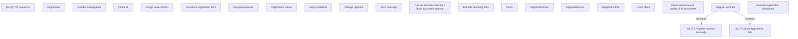

# Contract registration

```mermaid
graph TD
    ADD_TCK_queue_list["{ADD}TCK queue list"]
    Registration["Registration"]
    Mistake_investigation["Mistake investigation"]
    Check_all["Check all"]
    Assign_next_contract["Assign next contract"]
    Document_registration_form["Document registration form"]
    Assigned_operator["Assigned operator"]
    Registration_status["Registration status"]
    Report_mistakes["Report mistakes"]
    Change_operator["Change operator"]
    Error_message["Error message"]
    Turn_on_barcode_scanning_Scan_document_barcode["Turn on barcode scanning / Scan document barcode"]
    Barcode_scanning_form["Barcode scanning form"]
    Photo["Photo"]
    n_01_275_Show_registration_tab["01.275 Show registration tab"]
    RegistrationDate["RegistrationDate"]
    RegistrationUser["RegistrationUser"]
    RegistrationInfo["RegistrationInfo"]
    Client_photo["Client photo"]
    Check_presence_and_quality_of_all_documents["Check presence and quality of all documents"]
    Register_contract["Register contract"]
    Contract_registration_component["Contract registration component"]
    Register_contract["Register contract"]
    n_01_270_Register_contract_manually["01.270 Register contract manually"]
    Register_contract -->|unnamed| n_01_270_Register_contract_manually
    Register_contract -->|unnamed| n_01_275_Show_registration_tab
```
