# Document registration form

- **Diagram Type**: Custom
- **Package**: HomerSelect/BSL/Analysis Model/Contract Management/Contract registration/User Interface Model
- **Diagram ID**: 163266
- **Elements**: 17
- **Connectors**: 7

```mermaid
graph TD
    Mistake_list["Mistake list"]
    n_01_282_Edit_client_or_contract_document["01.282 Edit client or contract document"]
    ADD_Edit_document["{ADD}Edit document"]
    TCK_Record_document_mistake["TCK:Record document mistake"]
    n_01_275_Show_registration_tab["01.275 Show registration tab"]
    n_01_125_Upload_contract_document["01.125 Upload contract document"]
    n_01_112_Edit_DDM_document["01.112 Edit DDM document"]
    ADD_Edit_DDM_document["{ADD}Edit DDM document"]
    ADD_Upload_DDM_document["{ADD}Upload DDM document"]
    MOD_01_128_Preview_document["{MOD}01.128 Preview document"]
    Download["Download"]
    Checked_by["Checked by"]
    Additional_information["Additional information"]
    Attributes["Attributes"]
    Record_mistake["Record mistake"]
    Check["Check"]
    Document_registration_form["Document registration form"]
    Download -->|unnamed| MOD_01_128_Preview_document
    ADD_Edit_DDM_document -->|unnamed| n_01_112_Edit_DDM_document
    ADD_Upload_DDM_document -->|unnamed| n_01_125_Upload_contract_document
    ADD_Edit_DDM_document -->|unnamed| n_01_275_Show_registration_tab
    ADD_Upload_DDM_document -->|unnamed| n_01_275_Show_registration_tab
    Record_mistake -->|unnamed| TCK_Record_document_mistake
    ADD_Edit_document -->|unnamed| n_01_282_Edit_client_or_contract_document
```

