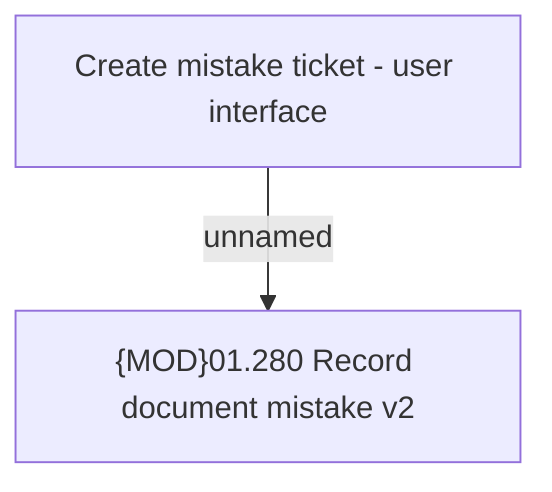

# TCK:Record document mistake

```mermaid
graph TD
    Create_mistake_ticket_user_interface["Create mistake ticket - user interface"]
    MOD_01_280_Record_document_mistake_v2["{MOD}01.280 Record document mistake v2"]
    Create_mistake_ticket_user_interface -->|unnamed| MOD_01_280_Record_document_mistake_v2
```
