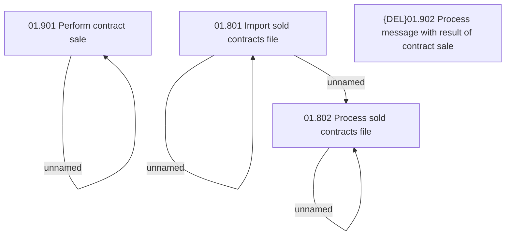

# Conract sale - Access rights

```mermaid
graph TD
    n_01_802_Process_sold_contracts_file["01.802 Process sold contracts file"]
    n_01_801_Import_sold_contracts_file["01.801 Import sold contracts file"]
    n_01_802_Process_sold_contracts_file["01.802 Process sold contracts file"]
    n_01_801_Import_sold_contracts_file["01.801 Import sold contracts file"]
    n_01_901_Perform_contract_sale["01.901 Perform contract sale"]
    DEL_01_902_Process_message_with_result_of_contract_sale["{DEL}01.902 Process message with result of contract sale"]
    n_01_901_Perform_contract_sale["01.901 Perform contract sale"]
    DEL_01_902_Process_message_with_result_of_contract_sale["{DEL}01.902 Process message with result of contract sale"]
    n_01_901_Perform_contract_sale -->|unnamed| n_01_901_Perform_contract_sale
    n_01_801_Import_sold_contracts_file -->|unnamed| n_01_801_Import_sold_contracts_file
    n_01_801_Import_sold_contracts_file -->|unnamed| n_01_802_Process_sold_contracts_file
    n_01_802_Process_sold_contracts_file -->|unnamed| n_01_802_Process_sold_contracts_file
```
