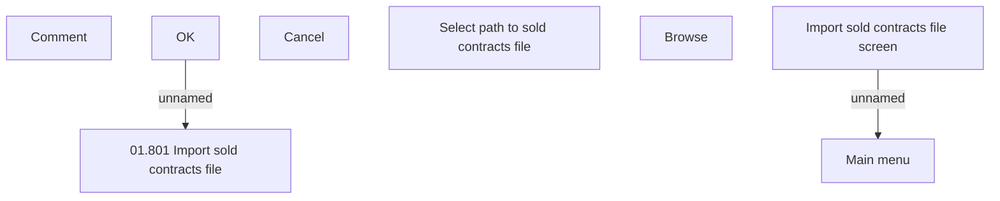

# Import sold contracts file screen

- **Diagram Type**: Custom
- **Package**: HomerSelect/BSL/Analysis Model/Contract Management/Contract sale/User Interface Model
- **Diagram ID**: 109592
- **Elements**: 8
- **Connectors**: 2

