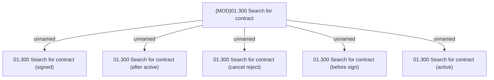

# Contract search - statuses

```mermaid
graph TD
    n_01_300_Search_for_contract_after_active["01.300 Search for contract (after active)"]
    n_01_300_Search_for_contract_signed["01.300 Search for contract (signed)"]
    n_01_300_Search_for_contract_cancel_reject["01.300 Search for contract (cancel reject)"]
    n_01_300_Search_for_contract_before_sign["01.300 Search for contract (before sign)"]
    n_01_300_Search_for_contract_active["01.300 Search for contract (active)"]
    MOD_01_300_Search_for_contract["{MOD}01.300 Search for contract"]
    MOD_01_300_Search_for_contract -->|unnamed| n_01_300_Search_for_contract_signed
    MOD_01_300_Search_for_contract -->|unnamed| n_01_300_Search_for_contract_after_active
    MOD_01_300_Search_for_contract -->|unnamed| n_01_300_Search_for_contract_cancel_reject
    MOD_01_300_Search_for_contract -->|unnamed| n_01_300_Search_for_contract_before_sign
    MOD_01_300_Search_for_contract -->|unnamed| n_01_300_Search_for_contract_active
```
