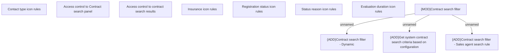

# Business rules

```mermaid
graph TD
    ADD_Contract_search_filter_Dynamic["{ADD}Contract search filter - Dynamic"]
    ADD_Get_system_contract_search_criteria_based_on_configurati["{ADD}Get system contract search criteria based on configuration"]
    ADD_Contract_search_filter_Sales_agent_search_rule["{ADD}Contract search filter - Sales agent search rule"]
    Contact_type_icon_rules["Contact type icon rules"]
    Access_control_to_Contract_search_panel["Access control to Contract search panel"]
    Access_control_to_contract_search_results["Access control to contract search results"]
    Insurance_icon_rules["Insurance icon rules"]
    Registration_status_icon_rules["Registration status icon rules"]
    Status_reason_icon_rules["Status reason icon rules"]
    Evaluation_duration_icon_rules["Evaluation duration icon rules"]
    MOD_Contract_search_filter["{MOD}Contract search filter"]
    MOD_Contract_search_filter -->|unnamed| ADD_Contract_search_filter_Dynamic
    MOD_Contract_search_filter -->|unnamed| ADD_Get_system_contract_search_criteria_based_on_configurati
    MOD_Contract_search_filter -->|unnamed| ADD_Contract_search_filter_Sales_agent_search_rule
```
