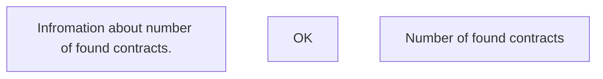

# Number of found contracts

- **Diagram Type**: Custom
- **Package**: HomerSelect/BSL/Analysis Model/Contract Management/Contract search/User Interface Model
- **Diagram ID**: 158515
- **Elements**: 3
- **Connectors**: 0

