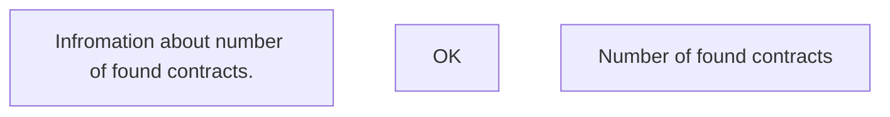

# Number of found contracts

```mermaid
graph TD
    Infromation_about_number_of_found_contracts["Infromation about number of found contracts."]
    OK["OK"]
    Number_of_found_contracts["Number of found contracts"]
```
