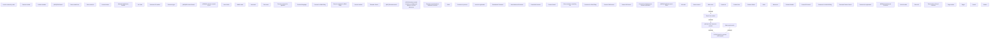

# Search for contract

```mermaid
graph TD
    Search_contract_by_code["Search contract by code"]
    Contract_number["Contract number"]
    Search_contract_by_code["Search contract by code"]
    Search_contract_by_code["Search contract by code"]
    Include_mistakes["Include mistakes"]
    Include_mistakes["Include mistakes"]
    ADD_CRM_Search["{ADD}CRM Search"]
    Date_created_from["Date created from"]
    Date_created_to["Date created to"]
    Contract_status["Contract status"]
    National_Identification_Number["National Identification Number"]
    Vin_Code["Vin Code"]
    Document_ID_number["Document ID number"]
    Document_type["Document type"]
    Contract_number["Contract number"]
    ADD_CRM_Search["{ADD}CRM Search"]
    ADD_CRM_Search["{ADD}CRM Search"]
    Vin_Code["Vin Code"]
    ADD_BO_Limited_Search["{ADD}BO Limited Search"]
    ADD_BO_Limited_Search["{ADD}BO Limited Search"]
    Document_ID_number["Document ID number"]
    Document_type["Document type"]
    Contract_number["Contract number"]
    ADD_BO_Limited_Search["{ADD}BO Limited Search"]
    ADD_All_contracts_created_by_me["{ADD}All contracts created by me"]
    Include_mistakes["Include mistakes"]
    Sales_agent_search["Sales agent search"]
    n_01_300_Search_for_contract_sales_agent["01.300 Search for contract (sales agent)"]
    Document_ID_number["Document ID number"]
    Document_type["Document type"]
    Date_of_birth["Date of birth"]
    Contract_number["Contract number"]
    Sales_agent_search["Sales agent search"]
    Sales_agent_search["Sales agent search"]
    Document_type["Document type"]
    Date_of_birth["Date of birth"]
    Middle_name["Middle name"]
    Last_name["Last name"]
    First_name["First name"]
    Document_ID_number["Document ID number"]
    Contract_number["Contract number"]
    Remote_contracts_for_signature["Remote contracts for signature"]
    Preferred_language["Preferred language"]
    Contract_for_2BoD_filling["Contract for 2BoD filling"]
    Remote_contracts_for_signature["Remote contracts for signature"]
    Date_of_birth["Date of birth"]
    Contract_number["Contract number"]
    Remote_contracts_for_2BoD_filling["Remote contracts for 2BoD filling"]
    Remote_contracts_for_2BoD_filling["Remote contracts for 2BoD filling"]
    Account_number["Account number"]
    Telesales_Search["Telesales Search"]
    Document_ID_number["Document ID number"]
    Document_type["Document type"]
    Contract_number["Contract number"]
    ADD_Telesales_search["{ADD}Telesales search"]
    ADD_Remotely_created_contracts_not_disbursed_signed_on_curre["{ADD}Remotely created contracts, not disbursed, signed on current salesroom"]
    Remotely_created_and_not_disbursed_contracts["Remotely created and not disbursed contracts"]
    Drafts["Drafts"]
    Contracts_in_process["Contracts in process"]
    Items_for_registration["Items for registration"]
    Reimbursed_Contracts["Reimbursed Contracts"]
    Nonreimbursed_Contracts["Nonreimbursed Contracts"]
    Cancelled_Contracts["Cancelled Contracts"]
    Custom_Search["Custom Search"]
    Show_contracts_created_by_me["Show contracts created by me"]
    Contracts_for_2BoD_filling["Contracts for 2BoD filling"]
    Custom_SNM_search["Custom SNM search"]
    Custom_BO_Search["Custom BO Search"]
    Contracts_for_disbursement_channel_verification["Contracts for disbursement channel verification"]
    MOD_Predefined_search_filters["{MOD}Predefined search filters"]
    Contract_number["Contract number"]
    Document_type["Document type"]
    Document_ID_number["Document ID number"]
    Date_created_from["Date created from"]
    Date_created_to["Date created to"]
    First_name["First name"]
    Last_name["Last name"]
    Date_of_birth["Date of birth"]
    Contract_status["Contract status"]
    Include_mistakes["Include mistakes"]
    VIN_code["VIN code"]
    Middle_name["Middle name"]
    National_Identification_Number["National Identification Number"]
    Custom_search["Custom search"]
    Main_menu["Main menu"]
    Contracts_for_disbursement_channel_verification["Contracts for disbursement channel verification"]
    Created_to["Created to"]
    Created_from["Created from"]
    Contract_Status["Contract Status"]
    Seller["Seller"]
    Salesroom["Salesroom"]
    Contract_Number["Contract Number"]
    Custom_BO_search["Custom BO search"]
    Contracts_for_2nd_BoD_filling["Contracts for 2nd BoD filling"]
    Extended_Custom_Search["Extended Custom Search"]
    Custom_SNM_search["Custom SNM search"]
    Contracts_for_registration["Contracts for registration"]
    Cancelled_Contracts["Cancelled Contracts"]
    MOD_Nonreimbursed_Contracts["{MOD}Nonreimbursed Contracts"]
    Reimbursed_Contracts["Reimbursed Contracts"]
    Contracts_in_process["Contracts in process"]
    Drafts["Drafts"]
    Custom_Search["Custom Search"]
    Grid_of_results["Grid of results"]
    Select_All["Select All"]
    Select_All["Select All"]
    Total_number_of_found_contracts["Total number of found contracts"]
    Created_to["Created to"]
    Created_from["Created from"]
    Contract_status["Contract status"]
    Seller["Seller"]
    Salesroom["Salesroom"]
    Contract_Number["Contract Number"]
    Custom_SNM_search["Custom SNM search"]
    Page_number["Page number"]
    Pages["Pages"]
    Search["Search"]
    Buttons["Buttons"]
    Search_for_contract["Search for contract"]
    MOD_01_300_Search_for_contract["{MOD}01.300 Search for contract"]
    MOD_01_300_Search_for_contract -->|unnamed| n_01_300_Search_for_contract_sales_agent
    Search_for_contract -->|unnamed| MOD_01_300_Search_for_contract
    Main_menu -->|unnamed| Search_for_contract
    Sales_agent_search -->|unnamed| n_01_300_Search_for_contract_sales_agent
```
