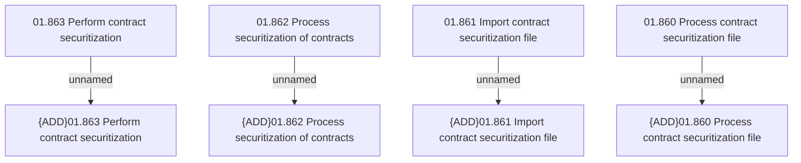

# Access rights

- **Diagram Type**: Custom
- **Package**: HomerSelect/BSL/Analysis Model/Contract Management/Contract securitization/Access rights
- **Diagram ID**: 85873
- **Elements**: 8
- **Connectors**: 4

