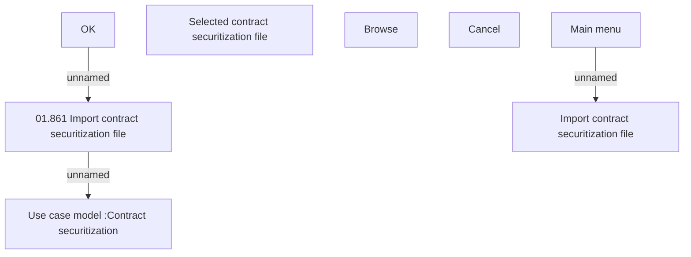

# Import contract securitization file - UI

```mermaid
graph TD
    Main_menu["Main menu"]
    Use_case_model_Contract_securitization["Use case model :Contract securitization"]
    Selected_contract_securitization_file["Selected contract securitization file"]
    Browse["Browse"]
    n_01_861_Import_contract_securitization_file["01.861 Import contract securitization file"]
    Cancel["Cancel"]
    OK["OK"]
    Import_contract_securitization_file["Import contract securitization file"]
    Main_menu -->|unnamed| Import_contract_securitization_file
    OK -->|unnamed| n_01_861_Import_contract_securitization_file
    n_01_861_Import_contract_securitization_file -->|unnamed| Use_case_model_Contract_securitization
```
