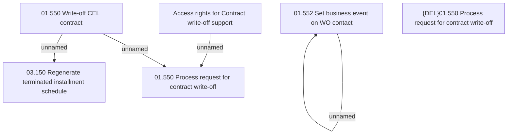

# Access rights

- **Diagram Type**: Custom
- **Package**: HomerSelect/BSL/Analysis Model/Contract Management/Contract write-off/Access rights
- **Diagram ID**: 161246
- **Elements**: 7
- **Connectors**: 5

