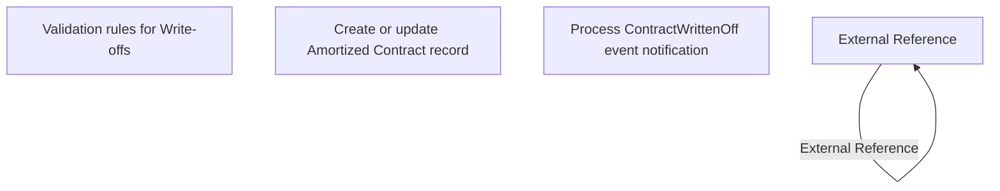

# Business rules

- **Diagram Type**: Custom
- **Package**: HomerSelect/BSL/Analysis Model/Contract Management/Contract write-off/Business rules
- **Diagram ID**: 159828
- **Elements**: 13
- **Connectors**: 7

