# Access Rights

- **Diagram Type**: Custom
- **Package**: HomerSelect/BSL/Analysis Model/Contract Management/Customer Self-Care API/Access Rights
- **Diagram ID**: 163302
- **Elements**: 87
- **Connectors**: 41

```mermaid
graph TD
    n_01_830_Get_ContractIBACKServiceStatus["01.830 Get ContractIBACKServiceStatus"]
    n_01_820_Get_ContractREWServiceStatus["01.820 Get ContractREWServiceStatus"]
    ADD_01_830_Get_ContractIBACkSeviceStatus["{ADD} 01.830 Get ContractIBACkSeviceStatus"]
    ADD_01_820_Get_ContractREWServiceStatus["{ADD} 01.820 Get ContractREWServiceStatus"]
    n_08_455_Reactivate_contract_insurance_service["08.455 Reactivate contract insurance service"]
    n_08_455_Reactivate_contract_insurance_service["08.455 Reactivate contract insurance service"]
    ADD_08_454_Terminate_contract_insurance_service_with_defined["{ADD}08.454 Terminate contract insurance service with defined termination date"]
    n_01_821_Rollback_Loan_Service_Request_service["01.821 Rollback Loan Service Request service"]
    n_01_821_Rollback_Loan_Service_Request_service["01.821 Rollback Loan Service Request service"]
    n_01_782_Replace_Contract_Service_skip_AM["01.782 Replace Contract Service (skip AM)"]
    n_01_812_Confirm_ContractLRESRequest_offer_service["01.812 Confirm ContractLRESRequest offer service"]
    n_01_811_Get_ContractLRESRequest_offer_service["01.811 Get ContractLRESRequest offer service"]
    n_01_810_Create_ContractLRESRequest_service["01.810 Create ContractLRESRequest service"]
    n_01_812_Confirm_ContractLRESRequest_offer_service["01.812 Confirm ContractLRESRequest offer service"]
    n_01_811_Get_ContractLRESRequest_offer_service["01.811 Get ContractLRESRequest offer service"]
    n_01_810_Create_ContractLRESRequest_service["01.810 Create ContractLRESRequest service"]
    n_01_782_Replace_Contract_Service_overrule["01.782 Replace Contract Service (overrule)"]
    n_01_782_Replace_Contract_Service["01.782 Replace Contract Service"]
    n_01_782_Replace_Contract_Service["01.782 Replace Contract Service"]
    n_01_797_Create_ContractPayholRequest_service["01.797 Create ContractPayholRequest service"]
    n_01_796_Get_ContractPayholRequest_preview_service["01.796 Get ContractPayholRequest preview service"]
    n_01_796_Get_ContractPayholRequest_preview_service["01.796 Get ContractPayholRequest preview service"]
    n_01_797_Create_ContractPayholRequest_service["01.797 Create ContractPayholRequest service"]
    n_01_795_Create_ContractCHDDRequest_service["01.795 Create ContractCHDDRequest service"]
    n_01_794_Get_ContractCHDDRequest_preview_service["01.794 Get ContractCHDDRequest preview service"]
    n_01_795_Create_ContractCHDDRequest_service["01.795 Create ContractCHDDRequest service"]
    n_01_794_Get_ContractCHDDRequest_preview_service["01.794 Get ContractCHDDRequest preview service"]
    n_01_793_Get_contract_account_overview["01.793 Get contract account overview"]
    n_01_793_Get_contract_account_overview["01.793 Get contract account overview"]
    n_01_788_Create_ContractPERRequest_service["01.788 Create ContractPERRequest service"]
    n_01_787_Get_ContractPERRequest_preview_service["01.787 Get ContractPERRequest preview service"]
    n_01_788_Create_ContractPERRequest_service["01.788 Create ContractPERRequest service"]
    n_01_787_Get_ContractPERRequest_preview_service["01.787 Get ContractPERRequest preview service"]
    n_08_392_Set_Refinanced_Contract_Closure_service["08.392 Set Refinanced Contract Closure service"]
    n_08_390_Get_Refinanced_Contracts_service["08.390 Get Refinanced Contracts service"]
    n_08_392_Set_Refinanced_Contract_Closure_service["08.392 Set Refinanced Contract Closure service"]
    n_08_390_Get_Refinanced_Contracts_service["08.390 Get Refinanced Contracts service"]
    n_01_774_Create_Contract_Service_AR["01.774 Create Contract Service AR"]
    MOD_01_774_Create_Contract_Service["{MOD}01.774 Create Contract Service"]
    n_01_792_Set_Document_ProofCheck_service["01.792 Set Document ProofCheck service"]
    n_01_792_Set_Document_ProofCheck_service["01.792 Set Document ProofCheck service"]
    n_01_791_Set_Document_File_service["01.791 Set Document File service"]
    n_01_791_Set_Document_File_service["01.791 Set Document File service"]
    n_08_454_Terminate_contract_insurance_service["08.454 Terminate contract insurance service"]
    n_08_453_Get_Contract_insurance_Terminate_preview_service["08.453 Get Contract insurance Terminate preview service"]
    n_08_454_Terminate_contract_insurance_service["08.454 Terminate contract insurance service"]
    n_08_453_Get_Contract_insurance_Terminate_preview_service["08.453 Get Contract insurance Terminate preview service"]
    n_08_452_Cancel_contract_insurance_service["08.452 Cancel contract insurance service"]
    n_08_451_Get_Contract_insurance_Cancel_preview_service["08.451 Get Contract insurance Cancel preview service"]
    n_08_452_Cancel_contract_insurance_service["08.452 Cancel contract insurance service"]
    n_08_451_Get_Contract_insurance_Cancel_preview_service["08.451 Get Contract insurance Cancel preview service"]
    n_08_342_Get_contract_insurance_offers_service["08.342 Get contract insurance offers service"]
    n_08_342_Get_contract_insurance_offers_service["08.342 Get contract insurance offers service"]
    n_01_790_Get_Contract_Documents_detail_service["01.790 Get Contract Documents detail service"]
    n_01_790_Get_Contract_Documents_detail_service["01.790 Get Contract Documents detail service"]
    n_01_786_Create_ContractFERRequest_service["01.786 Create ContractFERRequest service"]
    n_01_785_Get_ContractFERRequest_preview["01.785 Get ContractFERRequest preview"]
    n_01_786_Create_ContractFERRequest_service["01.786 Create ContractFERRequest service"]
    n_01_785_Get_ContractFERRequest_preview["01.785 Get ContractFERRequest preview"]
    n_01_784_Create_ContractCETRequest_service["01.784 Create ContractCETRequest service"]
    n_01_783_Get_ContractCETRequest_preview["01.783 Get ContractCETRequest preview"]
    n_01_784_Create_ContractCETRequest_service["01.784 Create ContractCETRequest service"]
    n_01_783_Get_ContractCETRequest_preview["01.783 Get ContractCETRequest preview"]
    n_01_773_Get_contract_financial_partnership_service["01.773 Get contract financial partnership service"]
    n_01_773_Get_contract_financial_partnership_service["01.773 Get contract financial partnership service"]
    n_01_772_Get_contract_list_insurances_for_self_care["01.772 Get contract list insurances for self-care"]
    MOD_01_772_Get_contract_list_insurances_for_self_care["{MOD}01.772 Get contract list insurances for self-care"]
    n_01_769_Set_Contract_Service_status["01.769 Set Contract Service status"]
    n_01_769_Set_Contract_Service_status["01.769 Set Contract Service status"]
    n_01_768_Get_Contract_Service_Request_Overview["01.768 Get Contract Service Request Overview"]
    n_01_768_Get_Contract_Service_Request_Overview["01.768 Get Contract Service Request Overview"]
    n_01_765_Get_early_repayment_preview_for_self_care["01.765 Get early repayment preview for self-care"]
    DEL_01_765_Get_early_repayment_preview_for_self_care["{DEL}01.765 Get early repayment preview for self-care"]
    n_01_764_Get_loan_account_overview_for_self_care["01.764 Get loan account overview for self-care"]
    MOD_01_763_Get_Contract_Documents_for_self_care["{MOD}01.763 Get Contract Documents for self-care"]
    n_01_762_Get_contract_payment_channels_for_self_care["01.762 Get contract payment channels for self-care"]
    n_01_761_Get_contract_service_requests_for_self_care["01.761 Get contract service requests for self-care"]
    n_01_759_Get_contract_services_for_self_care["01.759 Get contract services for self-care"]
    MOD_01_758_Get_contract_commodities_for_self_care["{MOD}01.758 Get contract commodities for self-care"]
    MOD_01_757_Get_contracts_for_self_care["{MOD}01.757 Get contracts for self-care"]
    n_01_764_Get_loan_account_overview_for_self_care["01.764 Get loan account overview for self-care"]
    n_01_763_Get_documents_for_self_care["01.763 Get documents for self-care"]
    n_01_762_Get_contract_payment_channels_for_self_care["01.762 Get contract payment channels for self-care"]
    n_01_761_Get_contract_service_requests_for_self_care["01.761 Get contract service requests for self-care"]
    n_01_759_Get_contract_services_for_self_care["01.759 Get contract services for self-care"]
    n_01_758_Get_contract_commodities_for_self_care["01.758 Get contract commodities for self-care"]
    n_01_757_Get_contracts_for_self_care["01.757 Get contracts for self-care"]
    n_01_796_Get_ContractPayholRequest_preview_service -->|unnamed| n_01_796_Get_ContractPayholRequest_preview_service
    n_01_797_Create_ContractPayholRequest_service -->|unnamed| n_01_797_Create_ContractPayholRequest_service
    n_01_783_Get_ContractCETRequest_preview -->|unnamed| n_01_783_Get_ContractCETRequest_preview
    n_01_784_Create_ContractCETRequest_service -->|unnamed| n_01_784_Create_ContractCETRequest_service
    n_01_811_Get_ContractLRESRequest_offer_service -->|unnamed| n_01_811_Get_ContractLRESRequest_offer_service
    n_01_792_Set_Document_ProofCheck_service -->|unnamed| n_01_792_Set_Document_ProofCheck_service
    ADD_01_830_Get_ContractIBACkSeviceStatus -->|unnamed| n_01_830_Get_ContractIBACKServiceStatus
    n_01_793_Get_contract_account_overview -->|unnamed| n_01_793_Get_contract_account_overview
    n_01_795_Create_ContractCHDDRequest_service -->|unnamed| n_01_795_Create_ContractCHDDRequest_service
    MOD_01_758_Get_contract_commodities_for_self_care -->|unnamed| n_01_758_Get_contract_commodities_for_self_care
    n_01_810_Create_ContractLRESRequest_service -->|unnamed| n_01_810_Create_ContractLRESRequest_service
    n_01_762_Get_contract_payment_channels_for_self_care -->|unnamed| n_01_762_Get_contract_payment_channels_for_self_care
    n_08_392_Set_Refinanced_Contract_Closure_service -->|unnamed| n_08_392_Set_Refinanced_Contract_Closure_service
    n_01_812_Confirm_ContractLRESRequest_offer_service -->|unnamed| n_01_812_Confirm_ContractLRESRequest_offer_service
    n_08_390_Get_Refinanced_Contracts_service -->|unnamed| n_08_390_Get_Refinanced_Contracts_service
    MOD_01_763_Get_Contract_Documents_for_self_care -->|unnamed| n_01_763_Get_documents_for_self_care
    n_01_768_Get_Contract_Service_Request_Overview -->|unnamed| n_01_768_Get_Contract_Service_Request_Overview
    MOD_01_757_Get_contracts_for_self_care -->|unnamed| n_01_757_Get_contracts_for_self_care
    n_01_761_Get_contract_service_requests_for_self_care -->|unnamed| n_01_761_Get_contract_service_requests_for_self_care
    n_01_786_Create_ContractFERRequest_service -->|unnamed| n_01_786_Create_ContractFERRequest_service
    n_01_764_Get_loan_account_overview_for_self_care -->|unnamed| n_01_764_Get_loan_account_overview_for_self_care
    n_01_787_Get_ContractPERRequest_preview_service -->|unnamed| n_01_787_Get_ContractPERRequest_preview_service
    MOD_01_772_Get_contract_list_insurances_for_self_care -->|unnamed| n_01_772_Get_contract_list_insurances_for_self_care
    n_01_791_Set_Document_File_service -->|unnamed| n_01_791_Set_Document_File_service
    n_01_785_Get_ContractFERRequest_preview -->|unnamed| n_01_785_Get_ContractFERRequest_preview
    n_01_759_Get_contract_services_for_self_care -->|unnamed| n_01_759_Get_contract_services_for_self_care
    ADD_01_820_Get_ContractREWServiceStatus -->|unnamed| n_01_820_Get_ContractREWServiceStatus
    n_01_794_Get_ContractCHDDRequest_preview_service -->|unnamed| n_01_794_Get_ContractCHDDRequest_preview_service
    n_01_821_Rollback_Loan_Service_Request_service -->|unnamed| n_01_821_Rollback_Loan_Service_Request_service
    DEL_01_765_Get_early_repayment_preview_for_self_care -->|unnamed| n_01_765_Get_early_repayment_preview_for_self_care
    n_01_788_Create_ContractPERRequest_service -->|unnamed| n_01_788_Create_ContractPERRequest_service
    n_01_773_Get_contract_financial_partnership_service -->|unnamed| n_01_773_Get_contract_financial_partnership_service
    n_01_790_Get_Contract_Documents_detail_service -->|unnamed| n_01_790_Get_Contract_Documents_detail_service
    n_08_342_Get_contract_insurance_offers_service -->|unnamed| n_08_342_Get_contract_insurance_offers_service
    n_08_451_Get_Contract_insurance_Cancel_preview_service -->|unnamed| n_08_451_Get_Contract_insurance_Cancel_preview_service
    n_08_452_Cancel_contract_insurance_service -->|unnamed| n_08_452_Cancel_contract_insurance_service
    n_08_453_Get_Contract_insurance_Terminate_preview_service -->|unnamed| n_08_453_Get_Contract_insurance_Terminate_preview_service
    n_08_454_Terminate_contract_insurance_service -->|unnamed| n_08_454_Terminate_contract_insurance_service
    n_08_454_Terminate_contract_insurance_service -->|unnamed| ADD_08_454_Terminate_contract_insurance_service_with_defined
    n_08_455_Reactivate_contract_insurance_service -->|unnamed| n_08_455_Reactivate_contract_insurance_service
    MOD_01_774_Create_Contract_Service -->|unnamed| n_01_774_Create_Contract_Service_AR
```

