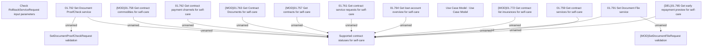

# Business Rules

```mermaid
graph TD
    Check_RollbackServiceRequest_input_parameters["Check RollbackServiceRequest input parameters"]
    MOD_01_772_Get_contract_list_insurances_for_self_care["{MOD}01.772 Get contract list insurances for self-care"]
    SetDocumentProofCheckRequest_validation["SetDocumentProofCheckRequest validation"]
    n_01_792_Set_Document_ProofCheck_service["01.792 Set Document ProofCheck service"]
    n_01_791_Set_Document_File_service["01.791 Set Document File service"]
    MOD_SetDocumentFileRequest_validation["{MOD}SetDocumentFileRequest validation"]
    DEL_01_765_Get_early_repayment_preview_for_self_care["{DEL}01.765 Get early repayment preview for self-care"]
    MOD_01_763_Get_Contract_Documents_for_self_care["{MOD}01.763 Get Contract Documents for self-care"]
    n_01_761_Get_contract_service_requests_for_self_care["01.761 Get contract service requests for self-care"]
    n_01_759_Get_contract_services_for_self_care["01.759 Get contract services for self-care"]
    Use_Case_Model_Use_Case_Model["Use Case Model : Use Case Model"]
    n_01_764_Get_loan_account_overview_for_self_care["01.764 Get loan account overview for self-care"]
    n_01_762_Get_contract_payment_channels_for_self_care["01.762 Get contract payment channels for self-care"]
    MOD_01_758_Get_contract_commodities_for_self_care["{MOD}01.758 Get contract commodities for self-care"]
    MOD_01_757_Get_contracts_for_self_care["{MOD}01.757 Get contracts for self-care"]
    Supported_contract_statuses_for_self_care["Supported contract statuses for self-care"]
    n_01_792_Set_Document_ProofCheck_service -->|unnamed| SetDocumentProofCheckRequest_validation
    n_01_792_Set_Document_ProofCheck_service -->|unnamed| Supported_contract_statuses_for_self_care
    MOD_01_758_Get_contract_commodities_for_self_care -->|unnamed| Supported_contract_statuses_for_self_care
    n_01_762_Get_contract_payment_channels_for_self_care -->|unnamed| Supported_contract_statuses_for_self_care
    MOD_01_763_Get_Contract_Documents_for_self_care -->|unnamed| Supported_contract_statuses_for_self_care
    MOD_01_757_Get_contracts_for_self_care -->|unnamed| Supported_contract_statuses_for_self_care
    n_01_761_Get_contract_service_requests_for_self_care -->|unnamed| Supported_contract_statuses_for_self_care
    n_01_764_Get_loan_account_overview_for_self_care -->|unnamed| Supported_contract_statuses_for_self_care
    MOD_01_772_Get_contract_list_insurances_for_self_care -->|unnamed| Supported_contract_statuses_for_self_care
    n_01_791_Set_Document_File_service -->|unnamed| MOD_SetDocumentFileRequest_validation
    n_01_791_Set_Document_File_service -->|unnamed| Supported_contract_statuses_for_self_care
    n_01_759_Get_contract_services_for_self_care -->|unnamed| Supported_contract_statuses_for_self_care
    DEL_01_765_Get_early_repayment_preview_for_self_care -->|unnamed| Supported_contract_statuses_for_self_care
```
