# Access Rights

- **Diagram Type**: Custom
- **Package**: HomerSelect/BSL/Analysis Model/Contract Management/Loan Service Processing/COMMON for Loan Services/Access Rights
- **Diagram ID**: 162728
- **Elements**: 49
- **Connectors**: 5

```mermaid
graph TD
    n_08_356_Generate_service_request_document_v2["08.356 Generate service request document v2"]
    ADD_08_495_Cancel_Contract_Service_externally["{ADD}08.495 Cancel Contract Service externally"]
    ADD_08_490_Terminate_Contract_Service_externally["{ADD}08.490 Terminate Contract Service externally"]
    n_08_495_Cancel_Contract_Service_externally["08.495 Cancel Contract Service externally"]
    n_08_490_Terminate_Contract_Service_externally["08.490 Terminate Contract Service externally"]
    MOD_08_096_Cancel_contract_service_common["{MOD}08.096 Cancel contract service common"]
    ADD_08_096_Cancel_contract_service_common["{ADD}08.096 Cancel contract service common"]
    MOD_08_091_Terminate_Contract_Service_common["{MOD}08.091 Terminate Contract Service common"]
    ADD_08_091_Terminate_service_common["{ADD}08.091 Terminate service common"]
    n_08_292_Process_Contract_Service_Change_event["08.292 Process Contract Service Change event"]
    ADD_08_292_Process_Contract_Service_Change_event["{ADD}08.292 Process Contract Service Change event"]
    n_08_352_Process_LoanServiceRequestRollbackSE_event["08.352 Process LoanServiceRequestRollbackSE event"]
    MOD_08_352_Process_LoanServiceRequestRollbackSE_event["{MOD}08.352 Process LoanServiceRequestRollbackSE event"]
    n_08_351_Rollback_PAYHOL_loan_service_request["08.351 Rollback PAYHOL loan service request"]
    n_08_351_Rollback_loan_service_request["08.351 Rollback loan service request "]
    n_08_085_Replace_service_manually_set_service_version["08.085 Replace service manually - set service version"]
    n_08_351_Rollback_loan_service_request["08.351 Rollback loan service request"]
    n_08_085_Replace_service_manually["08.085 Replace service manually"]
    n_08_085_Replace_Contract_Service_manually["08.085 Replace Contract Service manually"]
    n_08_357_Cancel_request_for_loan_service["08.357 Cancel request for loan service"]
    n_08_359_Print_service_request_document["08.359 Print service request document"]
    n_08_359_Print_service_request_document["08.359 Print service request document"]
    n_08_357_Cancel_request_for_loan_service["08.357 Cancel request for loan service"]
    n_08_356_Generate_service_request_document["08.356 Generate service request document"]
    n_08_095_Cancel_contract_service_manually["08.095 Cancel contract service manually"]
    n_08_330_Update_Budle_service_status["08.330 Update Budle service status"]
    n_08_300_Show_Bundle_service_status["08.300 Show Bundle service status"]
    n_08_330_Update_Bundle_service_status["08.330 Update Bundle service status"]
    MOD_08_095_Cancel_contract_service_manually["{MOD}08.095 Cancel contract service manually"]
    n_08_300_Show_Bundle_service_status["08.300 Show Bundle service status"]
    MOD_08_291_Switch_service_on_automatically["{MOD}08.291 Switch service on automatically"]
    n_08_291_Switch_service_on_automatically["08.291 Switch service on automatically"]
    n_08_080_Add_new_available_service_on_contract["08.080 Add new available service on contract"]
    n_08_070_Switch_service_on_off_manually["08.070 Switch service on/off manually"]
    n_08_030_Show_service_operation_status["08.030 Show service operation status"]
    n_08_030_Show_service_operation_status["08.030 Show service operation status"]
    Access_rights_for_service_evaluation_and_processing["Access rights for service evaluation and processing"]
    n_08_080_Add_new_available_Service_on_Contract["08.080 Add new available Service on Contract"]
    n_08_005_Apply_service_on_contract["08.005 Apply service on contract"]
    n_08_005_Apply_service_on_contract["08.005 Apply service on contract"]
    n_08_070_Switch_service_on_off_manually["08.070 Switch service on/off manually"]
    n_08_001_Check_contract_for_service_evaluation["08.001 Check contract for service evaluation"]
    n_08_001_Check_contract_for_service_evaluation["08.001 Check contract for service evaluation"]
    n_08_090_Terminate_service_manually["08.090 Terminate service manually"]
    n_08_090_Terminate_Contract_Service_manually["08.090 Terminate Contract Service manually"]
    n_08_020_Display_status_of_service_on_contract["08.020 Display status of service on contract"]
    n_08_020_Display_status_of_service_on_contract["08.020 Display status of service on contract"]
    n_08_010_Show_service_information["08.010 Show service information"]
    n_08_010_Show_service_information["08.010 Show service information"]
    Access_rights_for_service_evaluation_and_processing -->|unnamed| n_08_001_Check_contract_for_service_evaluation
    Access_rights_for_service_evaluation_and_processing -->|unnamed| n_08_005_Apply_service_on_contract
    n_08_001_Check_contract_for_service_evaluation -->|unnamed| n_08_001_Check_contract_for_service_evaluation
    n_08_005_Apply_service_on_contract -->|unnamed| n_08_005_Apply_service_on_contract
    n_08_357_Cancel_request_for_loan_service -->|unnamed| n_08_357_Cancel_request_for_loan_service
```

