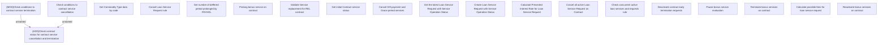

# Business Rules

```mermaid
graph TD
    MOD_Check_conditions_to_contract_service_termination["{MOD}Check conditions to contract service termination"]
    Check_conditions_to_contract_service_cancellation["Check conditions to contract service cancellation"]
    ADD_Check_contract_status_for_contract_service_cancellation_["{ADD}Check contract status for contract service cancellation and termination"]
    Get_Commodity_Type_data_by_code["Get Commodity Type data by code"]
    Cancel_Loan_Service_Request_rule["Cancel Loan Service Request rule"]
    Get_number_of_deffered_period_prolonged_by_PAYHOL["Get number of deffered period prolonged by PAYHOL"]
    Prolong_bonus_service_on_contract["Prolong bonus service on contract"]
    Validate_Service_replacement_for_REL_contract["Validate Service replacement for REL contract"]
    Get_initial_Contract_service_status["Get initial Contract service status"]
    Cancel_Gift_payment_and_Grace_period_services["Cancel Gift payment and Grace period services"]
    Get_the_latest_Loan_Service_Request_with_Service_Operation_S["Get the latest Loan Service Request with Service Operation Status"]
    Create_Loan_Service_Request_with_Service_Operation_Status["Create Loan Service Request with Service Operation Status"]
    Calculate_Presented_Interest_Rate_for_Loan_Service_Request["Calculate Presented Interest Rate for Loan Service Request"]
    Cancel_all_active_Loan_Service_Request_on_Contract["Cancel all active Loan Service Request on Contract"]
    Check_concurrent_active_loan_services_and_requests_rule["Check concurrent active loan services and requests rule"]
    Deactivate_contract_early_termination_requests["Deactivate contract early termination requests"]
    Pause_bonus_service_evaluation["Pause bonus service evaluation"]
    Terminate_bonus_services_on_contract["Terminate bonus services on contract"]
    Calculate_possible_fees_for_loan_service_request["Calculate possible fees for loan service request"]
    Reactivate_bonus_services_on_contract["Reactivate bonus services on contract"]
    MOD_Check_conditions_to_contract_service_termination -->|unnamed| ADD_Check_contract_status_for_contract_service_cancellation_
    Check_conditions_to_contract_service_cancellation -->|unnamed| ADD_Check_contract_status_for_contract_service_cancellation_
```
