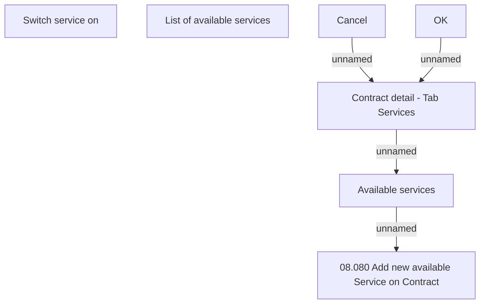

# Add available services

```mermaid
graph TD
    Switch_service_on["Switch service on"]
    n_08_080_Add_new_available_Service_on_Contract["08.080 Add new available Service on Contract"]
    Contract_detail_Tab_Services["Contract detail - Tab Services"]
    List_of_available_services["List of available services"]
    Cancel["Cancel"]
    OK["OK"]
    Available_services["Available services"]
    Contract_detail_Tab_Services -->|unnamed| Available_services
    Cancel -->|unnamed| Contract_detail_Tab_Services
    OK -->|unnamed| Contract_detail_Tab_Services
    Available_services -->|unnamed| n_08_080_Add_new_available_Service_on_Contract
```
