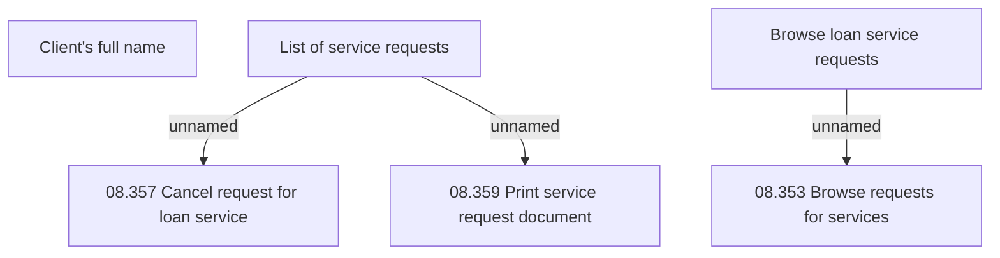

# Browse loan service requests

```mermaid
graph TD
    n_08_353_Browse_requests_for_services["08.353 Browse requests for services"]
    n_08_359_Print_service_request_document["08.359 Print service request document"]
    n_08_357_Cancel_request_for_loan_service["08.357 Cancel request for loan service"]
    Client_s_full_name["Client's full name"]
    List_of_service_requests["List of service requests"]
    Browse_loan_service_requests["Browse loan service requests"]
    List_of_service_requests -->|unnamed| n_08_357_Cancel_request_for_loan_service
    List_of_service_requests -->|unnamed| n_08_359_Print_service_request_document
    Browse_loan_service_requests -->|unnamed| n_08_353_Browse_requests_for_services
```
