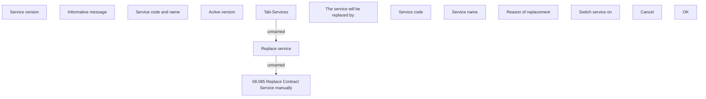

# Replace service

- **Diagram Type**: Custom
- **Package**: HomerSelect/BSL/Analysis Model/Contract Management/Loan Service Processing/COMMON for Loan Services/User Interface
- **Diagram ID**: 154388
- **Elements**: 15
- **Connectors**: 2

