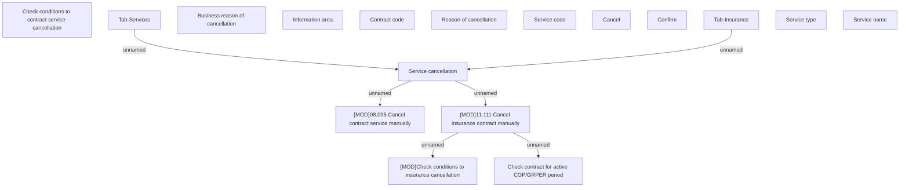

# Service cancellation

```mermaid
graph TD
    Check_conditions_to_contract_service_cancellation["Check conditions to contract service cancellation"]
    MOD_Check_conditions_to_insurance_cancellation["{MOD}Check conditions to insurance cancellation"]
    Tab_Services["Tab-Services"]
    MOD_08_095_Cancel_contract_service_manually["{MOD}08.095 Cancel contract service manually"]
    Business_reason_of_cancellation["Business reason of cancellation"]
    Information_area["Information area"]
    MOD_11_111_Cancel_insurance_contract_manually["{MOD}11.111 Cancel insurance contract manually"]
    Contract_code["Contract code"]
    Reason_of_cancellation["Reason of cancellation"]
    Service_code["Service code"]
    Cancel["Cancel"]
    Confirm["Confirm"]
    Tab_Insurance["Tab-Insurance"]
    Service_type["Service type"]
    Service_name["Service name"]
    Service_cancellation["Service cancellation"]
    Check_contract_for_active_COP_GRPER_period["Check contract for active COP/GRPER period"]
    Tab_Services -->|unnamed| Service_cancellation
    Tab_Insurance -->|unnamed| Service_cancellation
    Service_cancellation -->|unnamed| MOD_11_111_Cancel_insurance_contract_manually
    Service_cancellation -->|unnamed| MOD_08_095_Cancel_contract_service_manually
    MOD_11_111_Cancel_insurance_contract_manually -->|unnamed| MOD_Check_conditions_to_insurance_cancellation
    MOD_11_111_Cancel_insurance_contract_manually -->|unnamed| Check_contract_for_active_COP_GRPER_period
```
