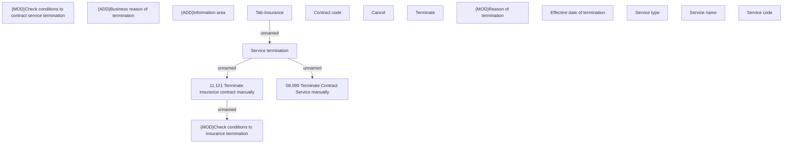

# Service termination

```mermaid
graph TD
    MOD_Check_conditions_to_contract_service_termination["{MOD}Check conditions to contract service termination"]
    MOD_Check_conditions_to_insurance_termination["{MOD}Check conditions to insurance termination"]
    ADD_Business_reason_of_termination["{ADD}Business reason of termination"]
    ADD_Information_area["{ADD}Information area"]
    n_11_121_Terminate_insurance_contract_manually["11.121 Terminate insurance contract manually"]
    Tab_Insurance["Tab-Insurance"]
    Contract_code["Contract code"]
    n_08_090_Terminate_Contract_Service_manually["08.090 Terminate Contract Service manually"]
    Cancel["Cancel"]
    Terminate["Terminate"]
    MOD_Reason_of_termination["{MOD}Reason of termination"]
    Effective_date_of_termination["Effective date of termination"]
    Service_type["Service type"]
    Service_name["Service name"]
    Service_code["Service code"]
    Service_termination["Service termination"]
    Tab_Insurance -->|unnamed| Service_termination
    Service_termination -->|unnamed| n_08_090_Terminate_Contract_Service_manually
    Service_termination -->|unnamed| n_11_121_Terminate_insurance_contract_manually
    n_11_121_Terminate_insurance_contract_manually -->|unnamed| MOD_Check_conditions_to_insurance_termination
```
