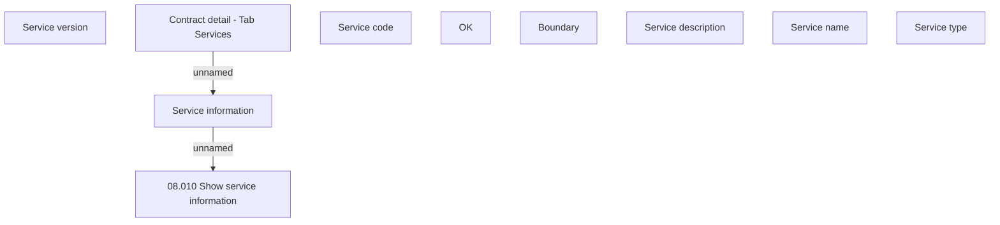

# Show service information

```mermaid
graph TD
    Service_version["Service version"]
    Contract_detail_Tab_Services["Contract detail - Tab Services"]
    Service_code["Service code"]
    OK["OK"]
    el_1779854["Boundary"]
    Service_description["Service description"]
    Service_name["Service name"]
    Service_type["Service type"]
    n_08_010_Show_service_information["08.010 Show service information"]
    Service_information["Service information"]
    Contract_detail_Tab_Services -->|unnamed| Service_information
    Service_information -->|unnamed| n_08_010_Show_service_information
```
