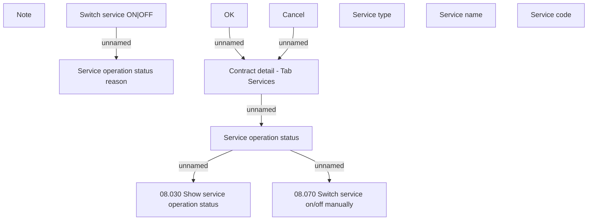

# Show service operation status

```mermaid
graph TD
    Note["Note"]
    OK["OK"]
    Service_operation_status_reason["Service operation status reason"]
    Switch_service_ON_OFF["Switch service ON|OFF"]
    Cancel["Cancel"]
    Service_operation_status["Service operation status"]
    Service_type["Service type"]
    Service_name["Service name"]
    Service_code["Service code"]
    Service_operation_status["Service operation status"]
    n_08_070_Switch_service_on_off_manually["08.070 Switch service on/off manually"]
    n_08_030_Show_service_operation_status["08.030 Show service operation status"]
    Contract_detail_Tab_Services["Contract detail - Tab Services"]
    OK -->|unnamed| Contract_detail_Tab_Services
    Cancel -->|unnamed| Contract_detail_Tab_Services
    Service_operation_status -->|unnamed| n_08_030_Show_service_operation_status
    Service_operation_status -->|unnamed| n_08_070_Switch_service_on_off_manually
    Contract_detail_Tab_Services -->|unnamed| Service_operation_status
    Switch_service_ON_OFF -->|unnamed| Service_operation_status_reason
```
