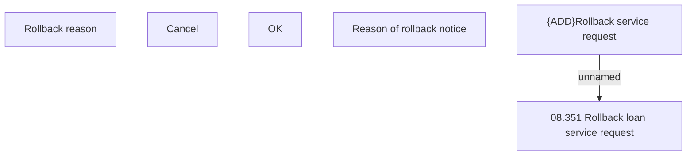

# {ADD}Rollback executed service request

- **Diagram Type**: Custom
- **Package**: HomerSelect/BSL/Analysis Model/Contract Management/Loan Service Processing/COMMON for Loan Services/User Interface
- **Diagram ID**: 154389
- **Elements**: 6
- **Connectors**: 1

