# Tab - Collection tools requests management

- **Diagram Type**: Custom
- **Package**: HomerSelect/BSL/Analysis Model/Contract Management/Loan Service Processing/Collection tools support/Collection tools management/User Interface Model
- **Diagram ID**: 152627
- **Elements**: 12
- **Connectors**: 5

```mermaid
graph TD
    n_13_275_Show_supplement_registration["13.275 Show supplement registration"]
    n_13_190_Reprint_supplement_documentation["13.190 Reprint supplement documentation"]
    Contract_Supplement_printout_list["Contract Supplement printout list"]
    n_08_351_Rollback_loan_service_request["08.351 Rollback loan service request"]
    n_08_400_Show_parameters_for_loan_restructuring["08.400 Show parameters for loan restructuring"]
    Cancel_service_request_screen["Cancel service request screen"]
    Information_area["Information area"]
    n_08_910_Manage_Collection_tool_service_requests["08.910 Manage Collection tool service requests"]
    Collection_tools_overview_main_screen["Collection tools overview (main screen)"]
    n_08_357_Cancel_request_for_loan_service["08.357 Cancel request for loan service"]
    Collection_tool_requests["Collection tool requests"]
    Tab_Collection_tools_requests["Tab - Collection tools requests"]
    Collection_tool_requests -->|unnamed| n_08_357_Cancel_request_for_loan_service
    Tab_Collection_tools_requests -->|unnamed| Collection_tools_overview_main_screen
    Tab_Collection_tools_requests -->|unnamed| n_08_910_Manage_Collection_tool_service_requests
    Collection_tool_requests -->|unnamed| n_08_400_Show_parameters_for_loan_restructuring
    Collection_tool_requests -->|unnamed| n_08_351_Rollback_loan_service_request
```

