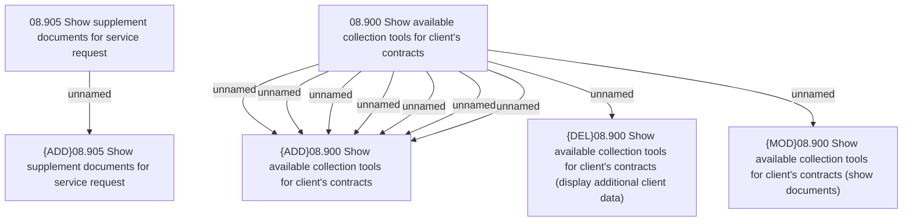

# Access Rights

```mermaid
graph TD
    ADD_08_900_Show_available_collection_tools_for_client_s_cont["{ADD}08.900 Show available collection tools for client's contracts (display Parent name)"]
    ADD_08_900_Show_available_collection_tools_for_client_s_cont["{ADD}08.900 Show available collection tools for client's contracts (display Gender)"]
    ADD_08_900_Show_available_collection_tools_for_client_s_cont["{ADD}08.900 Show available collection tools for client's contracts (display Date of birth)"]
    ADD_08_900_Show_available_collection_tools_for_client_s_cont["{ADD}08.900 Show available collection tools for client's contracts (show client´s phone)"]
    MOD_08_900_Show_available_collection_tools_for_client_s_cont["{MOD}08.900 Show available collection tools for client's contracts (show documents)"]
    DEL_08_900_Show_available_collection_tools_for_client_s_cont["{DEL}08.900 Show available collection tools for client's contracts (display additional client data)"]
    ADD_08_900_Show_available_collection_tools_for_client_s_cont["{ADD}08.900 Show available collection tools for client's contracts (show client address data)"]
    ADD_08_900_Show_available_collection_tools_for_client_s_cont["{ADD}08.900 Show available collection tools for client's contracts (show unmasked client email)"]
    ADD_08_905_Show_supplement_documents_for_service_request["{ADD}08.905 Show supplement documents for service request"]
    n_08_905_Show_supplement_documents_for_service_request["08.905 Show supplement documents for service request"]
    ADD_08_900_Show_available_collection_tools_for_client_s_cont["{ADD}08.900 Show available collection tools for client's contracts"]
    n_08_900_Show_available_collection_tools_for_client_s_contra["08.900 Show available collection tools for client's contracts"]
    n_08_900_Show_available_collection_tools_for_client_s_contra -->|unnamed| ADD_08_900_Show_available_collection_tools_for_client_s_cont
    n_08_905_Show_supplement_documents_for_service_request -->|unnamed| ADD_08_905_Show_supplement_documents_for_service_request
    n_08_900_Show_available_collection_tools_for_client_s_contra -->|unnamed| ADD_08_900_Show_available_collection_tools_for_client_s_cont
    n_08_900_Show_available_collection_tools_for_client_s_contra -->|unnamed| ADD_08_900_Show_available_collection_tools_for_client_s_cont
    n_08_900_Show_available_collection_tools_for_client_s_contra -->|unnamed| DEL_08_900_Show_available_collection_tools_for_client_s_cont
    n_08_900_Show_available_collection_tools_for_client_s_contra -->|unnamed| MOD_08_900_Show_available_collection_tools_for_client_s_cont
    n_08_900_Show_available_collection_tools_for_client_s_contra -->|unnamed| ADD_08_900_Show_available_collection_tools_for_client_s_cont
    n_08_900_Show_available_collection_tools_for_client_s_contra -->|unnamed| ADD_08_900_Show_available_collection_tools_for_client_s_cont
    n_08_900_Show_available_collection_tools_for_client_s_contra -->|unnamed| ADD_08_900_Show_available_collection_tools_for_client_s_cont
    n_08_900_Show_available_collection_tools_for_client_s_contra -->|unnamed| ADD_08_900_Show_available_collection_tools_for_client_s_cont
```
