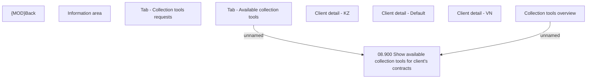

# Collection tools overview

```mermaid
graph TD
    MOD_Back["{MOD}Back"]
    Information_area["Information area"]
    n_08_900_Show_available_collection_tools_for_client_s_contra["08.900 Show available collection tools for client's contracts"]
    Tab_Collection_tools_requests["Tab - Collection tools requests"]
    Tab_Available_collection_tools["Tab - Available collection tools"]
    Client_detail_KZ["Client detail - KZ"]
    Client_detail_Default["Client detail - Default"]
    Client_detail_VN["Client detail - VN"]
    Collection_tools_overview["Collection tools overview"]
    Tab_Available_collection_tools -->|unnamed| n_08_900_Show_available_collection_tools_for_client_s_contra
    Collection_tools_overview -->|unnamed| n_08_900_Show_available_collection_tools_for_client_s_contra
```
