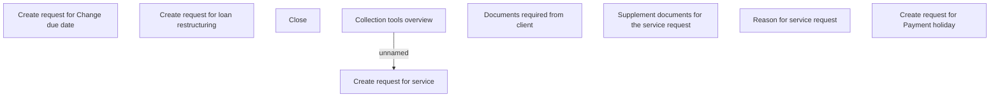

# Create collection tool service request

```mermaid
graph TD
    Create_request_for_Change_due_date["Create request for Change due date"]
    Create_request_for_loan_restructuring["Create request for loan restructuring"]
    Close["Close"]
    Collection_tools_overview["Collection tools overview"]
    Documents_required_from_client["Documents required from client"]
    Supplement_documents_for_the_service_request["Supplement documents for the service request"]
    Reason_for_service_request["Reason for service request"]
    Create_request_for_Payment_holiday["Create request for Payment holiday"]
    Create_request_for_service["Create request for service"]
    Collection_tools_overview -->|unnamed| Create_request_for_service
```
