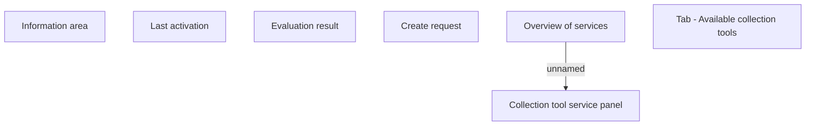

# Tab - Available collection tools

- **Diagram Type**: Custom
- **Package**: HomerSelect/BSL/Analysis Model/Contract Management/Loan Service Processing/Collection tools support/Collection tools requests/User Interface Model/Available collection tools
- **Diagram ID**: 147346
- **Elements**: 7
- **Connectors**: 1

