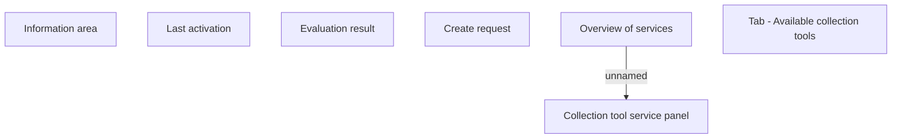

# Tab - Available collection tools

```mermaid
graph TD
    Information_area["Information area"]
    Last_activation["Last activation"]
    Evaluation_result["Evaluation result"]
    Create_request["Create request"]
    Collection_tool_service_panel["Collection tool service panel"]
    Overview_of_services["Overview of services"]
    Tab_Available_collection_tools["Tab - Available collection tools"]
    Overview_of_services -->|unnamed| Collection_tool_service_panel
```
