# Eligibility Criteria Repository

- **Diagram Type**: Custom
- **Package**: HomerSelect/BSL/Analysis Model/Contract Management/Loan Service Processing/Collection tools support/Eligibility Criteria Repository
- **Diagram ID**: 158815
- **Elements**: 21
- **Connectors**: 19

```mermaid
graph TD
    ADD_Minimal_number_of_paid_installments_to_apply_service["{ADD}Minimal number of paid installments to apply service"]
    ADD_Minimal_length_of_period_since_last_request["{ADD}Minimal length of period since last request"]
    ADD_Active_request_of_other_Service_type_exists["{ADD}Active request of other Service type exists"]
    ADD_Maximal_number_of_days_from_the_nearest_nonzero_installm["{ADD}Maximal number of days from the nearest nonzero installment"]
    Maximal_historical_DPD_on_contract["Maximal historical DPD on contract"]
    Minimal_number_of_days_before_service_usage["Minimal number of days before service usage"]
    MOD_Service_Eligibility_Criteria_Type_Setting["{MOD}Service Eligibility Criteria Type Setting"]
    Maximal_number_of_service_instance_usage_per_defined_period["Maximal number of service instance usage per defined period"]
    Maximal_number_of_service_usage_by_number_of_terms["Maximal number of service usage by number of terms"]
    Installment_schedule_exists["Installment schedule exists"]
    Grace_period_assigned["Grace period assigned"]
    Service_eligibility_rules["Service eligibility rules"]
    Active_collection_tool_service_request_exists["Active collection tool service request exists"]
    Maximal_number_of_service_type_usage_per_defined_period["Maximal number of service type usage per defined period"]
    Maximal_number_of_service_usage_on_contract["Maximal number of service usage on contract"]
    DEL_Client_eligibility_for_service_type["{DEL}Client eligibility for service type"]
    Maximal_current_DPD_on_contract["Maximal current DPD on contract"]
    Number_of_remaining_installments_to_apply_service["Number of remaining installments to apply service"]
    Moratorium_for_service_usage["Moratorium for service usage"]
    Contract_is_in_defined_status["Contract is in defined status"]
    Active_request_of_the_same_service_type_exists["Active request of the same service type exists"]
    Active_request_of_the_same_service_type_exists -->|unnamed| Service_eligibility_rules
    ADD_Minimal_length_of_period_since_last_request -->|unnamed| Service_eligibility_rules
    ADD_Active_request_of_other_Service_type_exists -->|unnamed| Service_eligibility_rules
    ADD_Maximal_number_of_days_from_the_nearest_nonzero_installm -->|unnamed| Service_eligibility_rules
    Maximal_historical_DPD_on_contract -->|unnamed| Service_eligibility_rules
    Minimal_number_of_days_before_service_usage -->|unnamed| Service_eligibility_rules
    Maximal_number_of_service_instance_usage_per_defined_period -->|unnamed| Service_eligibility_rules
    Maximal_number_of_service_usage_by_number_of_terms -->|unnamed| Service_eligibility_rules
    Active_collection_tool_service_request_exists -->|unnamed| Service_eligibility_rules
    Grace_period_assigned -->|unnamed| Service_eligibility_rules
    Installment_schedule_exists -->|unnamed| Service_eligibility_rules
    Maximal_number_of_service_type_usage_per_defined_period -->|unnamed| Service_eligibility_rules
    Maximal_number_of_service_usage_on_contract -->|unnamed| Service_eligibility_rules
    DEL_Client_eligibility_for_service_type -->|unnamed| Service_eligibility_rules
    Maximal_current_DPD_on_contract -->|unnamed| Service_eligibility_rules
    Number_of_remaining_installments_to_apply_service -->|unnamed| Service_eligibility_rules
    Moratorium_for_service_usage -->|unnamed| Service_eligibility_rules
    Contract_is_in_defined_status -->|unnamed| Service_eligibility_rules
    ADD_Minimal_number_of_paid_installments_to_apply_service -->|unnamed| Service_eligibility_rules
```

