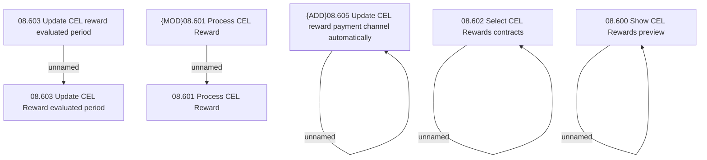

# Access Rights

- **Diagram Type**: Custom
- **Package**: HomerSelect/BSL/Analysis Model/Contract Management/Loan Service Processing/Loan Option CEL/CEL Rewards/Access Rights
- **Diagram ID**: 135493
- **Elements**: 10
- **Connectors**: 5

