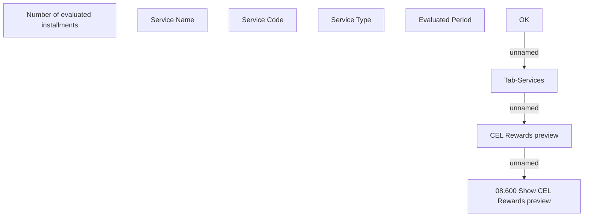

# CEL Reward preview

```mermaid
graph TD
    Number_of_evaluated_installments["Number of evaluated installments"]
    Service_Name["Service Name"]
    Service_Code["Service Code"]
    Service_Type["Service Type"]
    Evaluated_Period["Evaluated Period"]
    Tab_Services["Tab-Services"]
    OK["OK"]
    n_08_600_Show_CEL_Rewards_preview["08.600 Show CEL Rewards preview"]
    CEL_Rewards_preview["CEL Rewards preview"]
    Tab_Services -->|unnamed| CEL_Rewards_preview
    CEL_Rewards_preview -->|unnamed| n_08_600_Show_CEL_Rewards_preview
    OK -->|unnamed| Tab_Services
```
