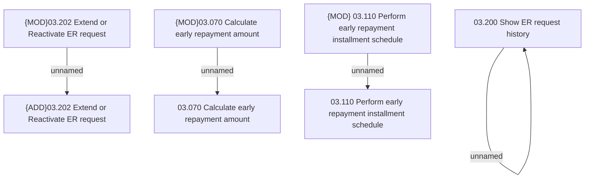

# Access Rights

- **Diagram Type**: Custom
- **Package**: HomerSelect/BSL/Analysis Model/Contract Management/Loan Service Processing/Loan Option CEL/COMMON for Early Repayment/Access Rights
- **Diagram ID**: 161597
- **Elements**: 8
- **Connectors**: 4

