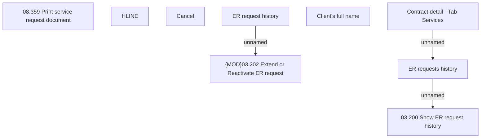

# ER request history

- **Diagram Type**: Custom
- **Package**: HomerSelect/BSL/Analysis Model/Contract Management/Loan Service Processing/Loan Option CEL/COMMON for Early Repayment/User Interface/ER request history screen
- **Diagram ID**: 164354
- **Elements**: 9
- **Connectors**: 3

