# Early repayment preview

- **Diagram Type**: Custom
- **Package**: HomerSelect/BSL/Analysis Model/Contract Management/Loan Service Processing/Loan Option CEL/COMMON for Early Repayment/User Interface/ER request preview
- **Diagram ID**: 134288
- **Elements**: 17
- **Connectors**: 5

```mermaid
graph TD
    Contract_detail_Tab_Services["Contract detail - Tab Services"]
    CET_Early_repayment_preview["CET Early repayment preview"]
    COP_Early_repayment_preview["COP Early repayment preview"]
    Full_Early_Repayment_preview["Full Early Repayment preview"]
    Change_due_date["Change due date"]
    HLINE["HLINE"]
    Early_repayment_due_date["Early repayment due date"]
    Contract_date["Contract date"]
    Contract_number["Contract number"]
    Conditions_for_ER_fulfilled["Conditions for ER fulfilled"]
    Client_s_full_name["Client's full name"]
    Cancel["Cancel"]
    Notification_area["Notification area"]
    ER_Grid_Row_Item["ER Grid Row Item"]
    Create_request["Create request"]
    Full_early_repayment_result["Full early repayment result"]
    Early_repayment_preview["Early repayment preview"]
    COP_Early_repayment_preview -->|unnamed| Early_repayment_preview
    Full_Early_Repayment_preview -->|unnamed| Early_repayment_preview
    CET_Early_repayment_preview -->|unnamed| Early_repayment_preview
    Full_early_repayment_result -->|unnamed| ER_Grid_Row_Item
    Cancel -->|unnamed| Contract_detail_Tab_Services
```

