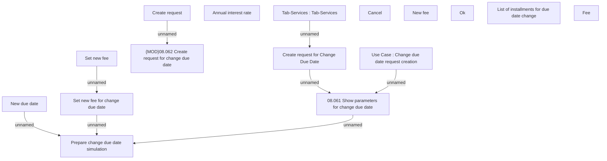

# Create request for Change due date

```mermaid
graph TD
    Tab_Services_Tab_Services["Tab-Services : Tab-Services"]
    Prepare_change_due_date_simulation["Prepare change due date simulation"]
    Annual_interest_rate["Annual interest rate"]
    Use_Case_Change_due_date_request_creation["Use Case : Change due date request creation"]
    n_08_061_Show_parameters_for_change_due_date["08.061 Show parameters for change due date"]
    MOD_08_062_Create_request_for_change_due_date["{MOD}08.062 Create request for change due date"]
    Create_request["Create request"]
    Cancel["Cancel"]
    New_fee["New fee"]
    Cancel["Cancel"]
    Ok["Ok"]
    Set_new_fee_for_change_due_date["Set new fee for change due date"]
    List_of_installments_for_due_date_change["List of installments for due date change"]
    Set_new_fee["Set new fee"]
    Fee["Fee"]
    New_due_date["New due date"]
    Create_request_for_Change_Due_Date["Create request for Change Due Date"]
    Tab_Services_Tab_Services -->|unnamed| Create_request_for_Change_Due_Date
    Set_new_fee -->|unnamed| Set_new_fee_for_change_due_date
    Create_request -->|unnamed| MOD_08_062_Create_request_for_change_due_date
    Create_request_for_Change_Due_Date -->|unnamed| n_08_061_Show_parameters_for_change_due_date
    Use_Case_Change_due_date_request_creation -->|unnamed| n_08_061_Show_parameters_for_change_due_date
    New_due_date -->|unnamed| Prepare_change_due_date_simulation
    Set_new_fee_for_change_due_date -->|unnamed| Prepare_change_due_date_simulation
    n_08_061_Show_parameters_for_change_due_date -->|unnamed| Prepare_change_due_date_simulation
```
